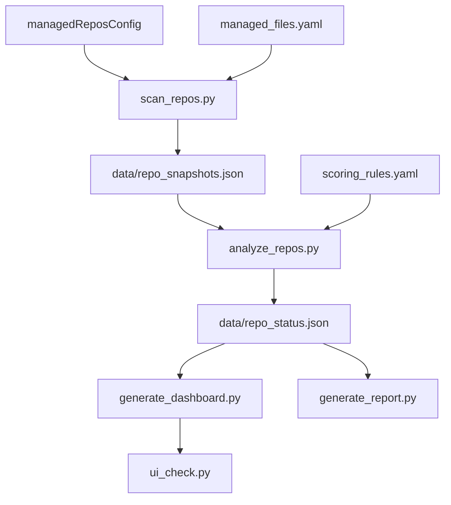

# 架构说明

## 定位

`repo-ops-dashboard` 是本地多仓库治理中枢，读取管理文件并输出状态洞察，不进入业务源码层。

**核心价值不是替代 Cursor 或 Codex**，而是建立个人多仓库状态总控台。OpenClaw 后续只作为调度入口和提醒入口，不负责主力代码开发。

## 分层

1. **配置层**：`config/*.yaml`
2. **采集层**：`scripts/scan_repos.py`
3. **分析层**：`scripts/analyze_repos.py`
4. **输出层**：`dashboard/*` 与 `reports/*`
5. **治理层**：`repo_protocol_standard.yaml`、`AGENTS.md`、`scripts/agent_gate.py`
6. **UI 检查层**：`scripts/ui_check.py`（Playwright，仅本地 Dashboard）

## 数据流

## 长期目标

1. 管理多个本地仓库状态
2. 只读取每个仓库的管理文件
3. 汇总项目进度、判断优先级
4. 识别卡住 / 应冻结 / 应归档的仓库
5. 生成日报/周报与 Cursor/Codex Prompt
6. 后续 OpenClaw 调度脚本与报告
7. 后续 Feishu/Lark 或 Mac 通知

## 关键边界

- 只读目标仓库管理文件
- 不修改业务仓库
- 所有风险动作默认禁止
- Playwright 仅 `file://` 本地 Dashboard，不访问外网
