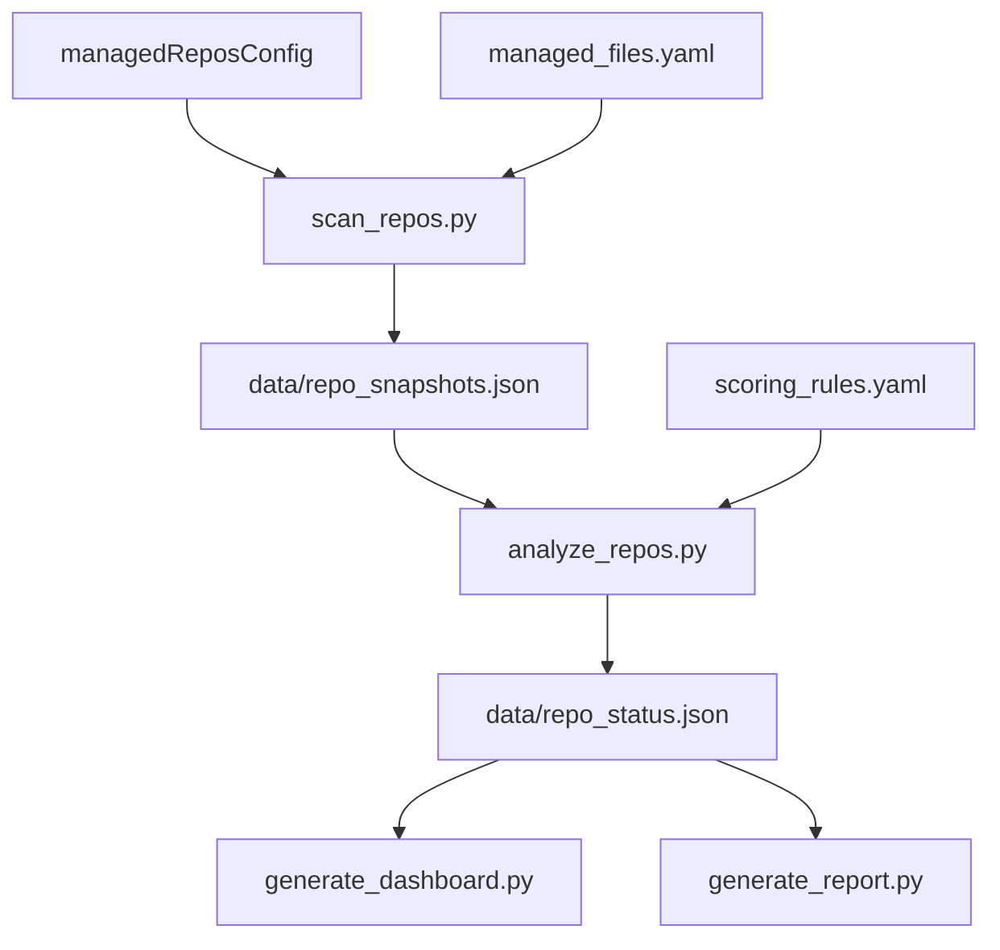

# 架构说明

## 定位

`repo-ops-dashboard` 是本地多仓库治理中枢，读取管理文件并输出状态洞察，不进入业务源码层。

## 分层

1. 配置层：`config/*.yaml`
2. 采集层：`scripts/scan_repos.py`
3. 分析层：`scripts/analyze_repos.py`
4. 输出层：`dashboard/*` 与 `reports/*`
5. 治理层：`repo_protocol_standard.yaml`、`AGENTS.md`、`scripts/agent_gate.py`

## 数据流

## 关键边界

- 只读目标仓库管理文件。
- 不修改业务仓库。
- 所有风险动作默认禁止。
